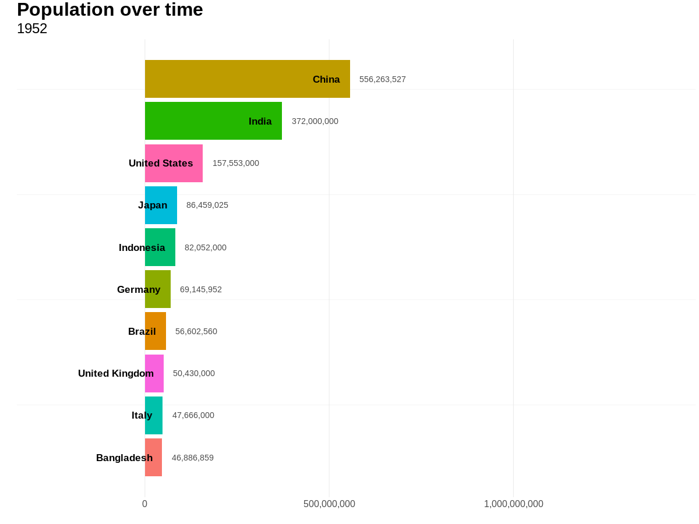

<!-- README.md is generated from README.Rmd. Please edit that file -->

# barRacer 

<!-- badges: start -->

<!-- badges: end -->

The goal of barRacer is to provide a simple function to generate bar
chart race animations using `ggplot2` and `gganimate`.

## Installation

This package is not yet on CRAN.

You can install the development version of barRacer from
[GitHub](https://github.com/) with:

``` r
# install.packages("devtools")
devtools::install_github("jl5000/barRacer")
```

## Example

This simple example uses the `gapminder` dataset:

``` r
#install.packages("gapminder")
library(barRacer)

bar_chart_race(gapminder::gapminder, country, pop, year, title = "Population over time")
```


